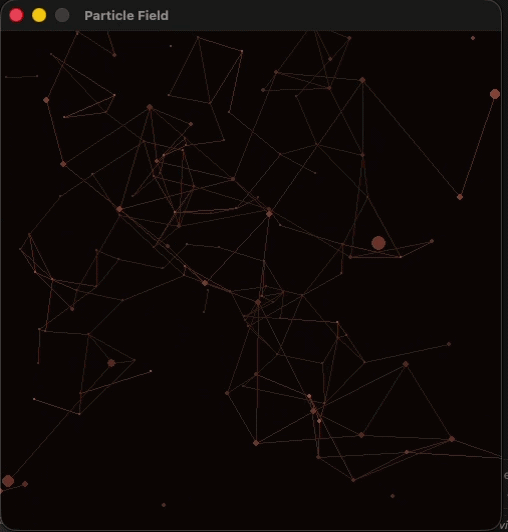

# Particle Field — Audio-Reactive Visualizer

A `pygame` audio visualizer that flies a virtual camera through a 3D field of
particles in real time, driven by whatever audio is playing on your system.
Instead of shapes pulsing on screen, the camera itself moves — flying
forward, spiraling, and cutting to new angles — while a sparse web of
"constellation" lines connects nearby particles and pulses with the music's
frequency content.

## Features

- **Perspective-driven motion.** Particles are fixed in 3D space; what moves
  is the camera (yaw, pitch, roll, and forward travel). Depth and parallax
  come from real perspective projection, not particle animation.
- **Continuous forward flight.** The camera flies through the field
  indefinitely — particles that pass behind it respawn far ahead, so the
  tunnel never runs out.
- **Audio-driven spiral.** The whole field slowly rolls around the flight
  axis, speeding up with the music's energy.
- **Camera cuts on big hits.** A noticeably strong bass hit swings the
  camera to a new angle bias, with a cooldown so it doesn't happen on every
  beat.
- **Per-particle frequency reactivity.** Each particle is assigned one
  frequency bin and brightens when that part of the spectrum is loud, so
  different particles light up for different instruments/frequencies.
- **Constellation web.** A precomputed set of nearest-neighbor connections
  between particles, redrawn every frame from their current projected
  positions, pulsing brighter with the audio.
- **Rust / burnt-orange palette**, dark background, no external color
  cycling — everything stays in one cohesive color family.

## Requirements

- Python 3.9+
- [`pygame`](https://www.pygame.org/)
- [`numpy`](https://numpy.org/)
- [`sounddevice`](https://python-sounddevice.readthedocs.io/)

```bash
pip install pygame numpy sounddevice
```

## Audio input setup

This visualizer reacts to whatever audio is captured by your **input**
device — it does not read audio files or streams directly.

- **To react to your microphone**, no extra setup is needed.
- **To react to music/audio playing on your computer** (the more common use
  case), you need a loopback/virtual audio device, since Python can't
  capture system output directly:
  - **macOS:** [BlackHole](https://existential.audio/blackhole/) (free).
    For best results, set up an **Aggregate Device** in Audio MIDI Setup
    that combines BlackHole with your regular speakers/headphones — this
    lets audio play out loud *and* get captured at the same time.
  - **Windows:** Enable "Stereo Mix" if your audio driver supports it, or
    use a virtual audio cable app (e.g. VB-Audio Virtual Cable).

The script automatically searches connected input devices for one with
`"aggregate"` or `"blackhole"` in its name, in that order, and falls back
to your system's default input device if neither is found. It prints
which device it picked on startup.

If you want to see all available devices and confirm which one is being
selected:

```bash
python3 list_devices.py
```

## Usage

```bash
python3 visualizer.py
```

- **Esc** or **Delete** — quit
- Play audio through whatever input device the script is capturing (see
  above), and the field will react.

## How it works

- Particles are generated once at startup with a fixed `(x, y, z)` position
  and a randomly assigned frequency bin.
- Every frame, the camera's position (`camera_z`) and orientation (yaw,
  pitch, roll) update based on elapsed time and the current audio energy.
- Each particle's position is projected into screen space by rotating it
  into camera space (roll → yaw → pitch) and applying a perspective divide
  (`scale = focal_length / depth`). Nothing about the particle itself
  moves — only the camera's frame of reference changes, which is what
  produces the parallax effect.
- Particles whose depth relative to the camera drops below a threshold
  (i.e. the camera has flown past them) are repositioned far ahead and
  reassigned a new frequency bin.
- A sparse set of nearest-neighbor connections between particles is
  precomputed once, then refreshed for any particle that respawns, and
  redrawn every frame using each particle's current projected position.

## Demo



## Tuning


A few constants near the top of the main loop are the main knobs:

| Constant | Effect |
|---|---|
| `NUM_PARTICLES` | Density of the field |
| `FOCAL_LENGTH` | Field of view — lower feels more "wide angle" |
| `FORWARD_BASE_SPEED` / `FORWARD_ENERGY_SPEED` | Idle vs. audio-driven forward speed |
| `ROLL_BASE_SPEED` / `ROLL_ENERGY_SPEED` | Idle vs. audio-driven spiral speed |
| `CUT_COOLDOWN` | Minimum seconds between camera-angle cuts |
| `CONNECTION_MAX_DIST` | How close particles need to be to connect |
| `rust_color()` | The color palette — adjust `hue` to change the overall color family |

## Troubleshooting

- **`PortAudioError` about channels on startup** — the selected device
  doesn't support the requested channel count. The script requests at most
  2 channels and clamps to what the device reports, but if you hardcode a
  different device, check its `max_input_channels` first.
- **No visible reaction to sound** — almost always an input device issue,
  not a code issue. Run `list_devices.py` and confirm the script is
  capturing the device your audio is actually routed through (e.g. your
  aggregate/loopback device), not your microphone.
